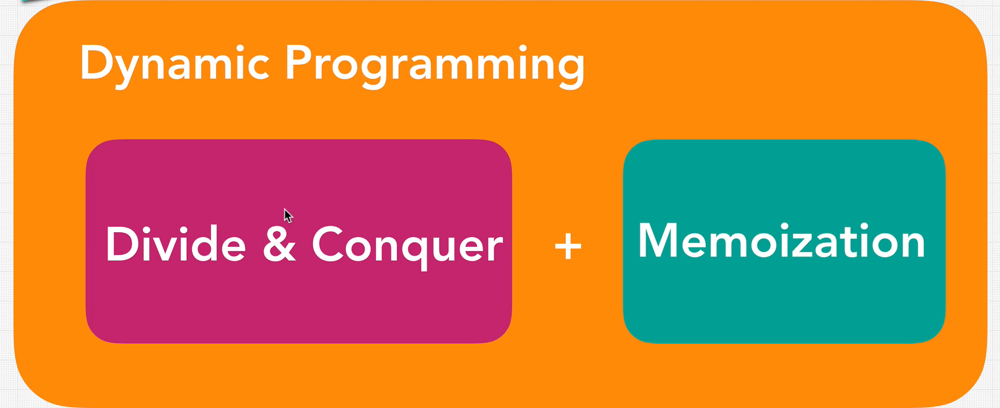

## 1. Dynamic Programming is a technique to optimize algorithms by memorizing - caching

Example:

```javascript
let cache = {};
function memoizedAddTo80(n) {
  if (n in cache) {
    return cache[n];
  } else {
    console.log("long time.......");
    cache[n] = n + 80;
    return cache[n];
  }
}

console.log("1", memoizedAddTo80(5)); // longtime 85
console.log("2", memoizedAddTo80(5)); // 85
console.log("2", memoizedAddTo80(6)); // longtime 86
```

Update with closure

```javascript
function memoizedAddTo80() {
  let cache = {};
  return function (n) {
    if (n in cache) {
      return cache[n];
    } else {
      console.log("long time.......");
      cache[n] = n + 80;
      return cache[n];
    }
  };
}

const memoized = memoizedAddTo80();

console.log("1", memoized(5)); // longtime 85
console.log("2", memoized(5)); // 85
console.log("2", memoized(6)); // longtime 86
```

## 2. Example with Fibonacci

```javascript
let calculations = 0;
function fibonacci(n) {
  // O(2^n)
  calculations++;
  if (n > 2) {
    return n;
  }
  return fibonacci(n - 1) + fibonacci(n - 2);
}

function fibonacciMaster() {
  // O(n)
  let cache = {};
  return function fib(n) {
    if (n in cache) {
      return cache[n];
    } else {
      if (n < 2) {
        return n;
      } else {
        cache[n] = fib(n - 1) + fib(n - 2);
        return cache[n];
      }
    }
  };
}
```

## 3. Dynamic Programming



Rules:

1. Can be divided into subproblem
2. Recursive Solution
3. Are there repetitive subproblems
4. Memoize subproblems
