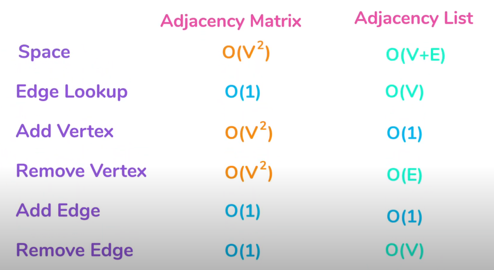
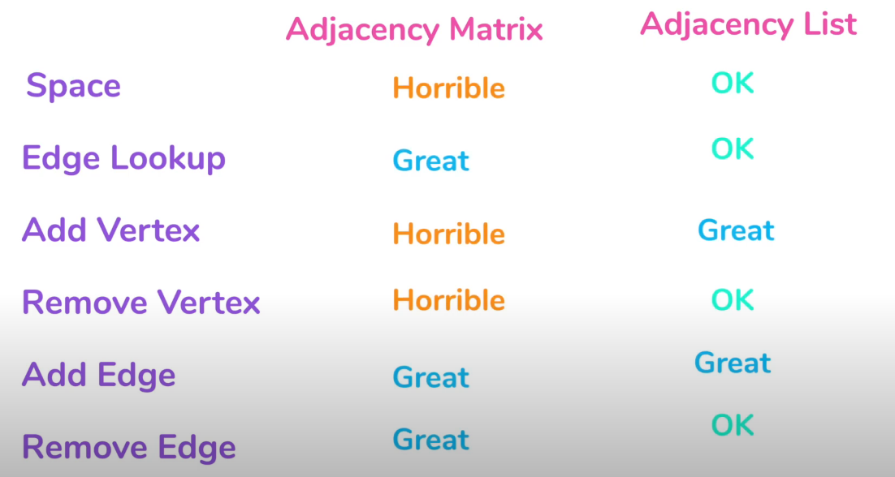

## Types of graphs
- Directed (Twitter: A --follows-> B)
- Undirected (Facebook: A <-friends-> B)
- Weighted
- Unweighted (Google Maps)
- Cyclic (cycle)
- Acyclic (no cycle)
## Graph data
- Edge list // [[0, 2], [2, 3], [2, 1], [1, 3]]
- Adjacent list // [[2], [2, 3], [0, 1, 3], [1, 2]] : List of lists || map of lists
- Adjacent matrix

### What would you use ?
- If the graph is sparse: adjacency list  save space
- If want to check relation of 2 vertix: use matrix much faster

