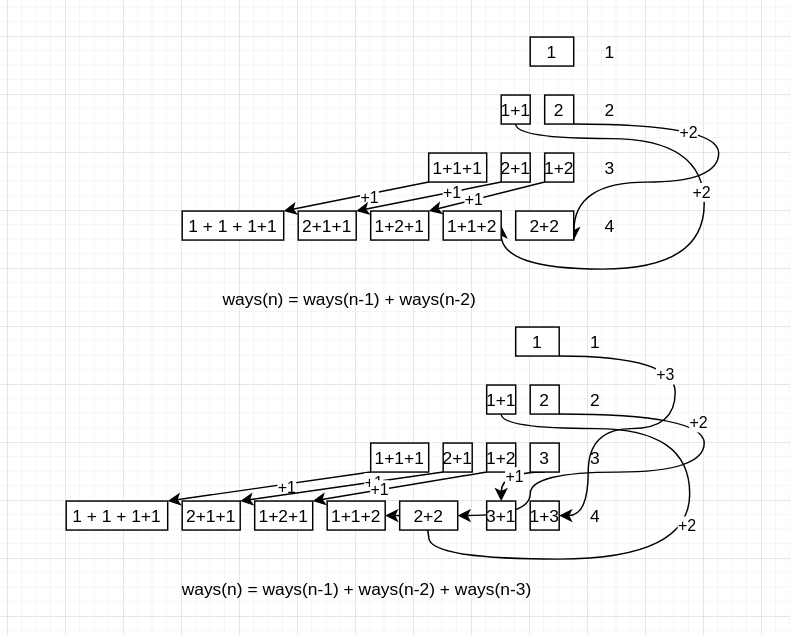

Leetcode: https://leetcode.com/problems/climbing-stairs/

- Because we can only take 1 or 2 steps at a time so at step n, there are 2 scenerios: at n-2 we take 2 steps, at n-1 we take 1 step.
- So at step n, we have X ways to take us to step n-1, each way we will take 1 step to reach n; and Y ways to take us to step n-2, each way we will take 2 steps to reach n.
- Look at diagram below, easier to understand.



```go
func climbStairs(n int) int {
  ways := []int{1, 2}
  for i := 2; i<n; i++{
    ways = append(ways, ways[i-1] + ways[i-2])
  }
  return ways[n-1]
}
```

So what if we can take 3 steps at a time, how many ways can we reach to step n ?
As the diagram up here. we can tell `ways(n) = ways(n-1) + ways(n-2) + ways(n-3)`
