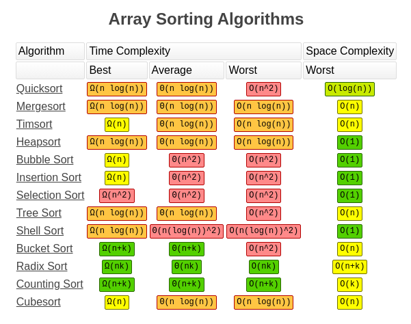
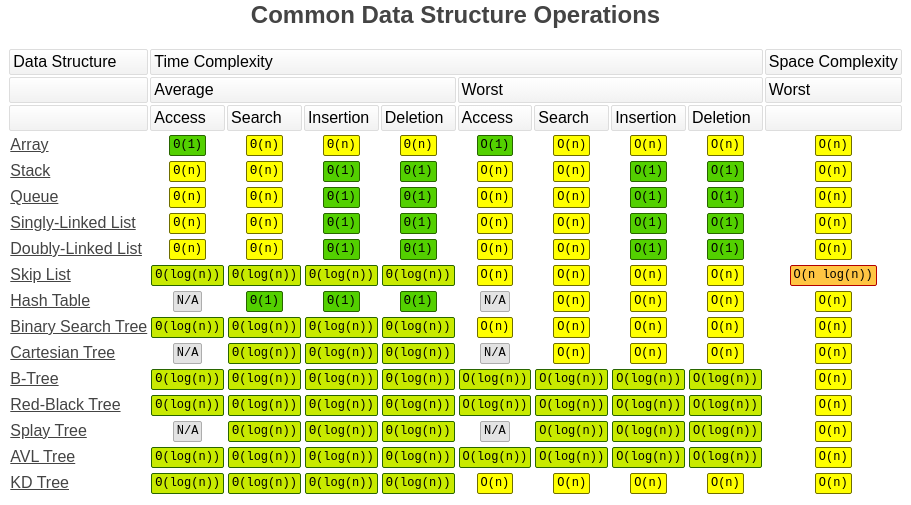
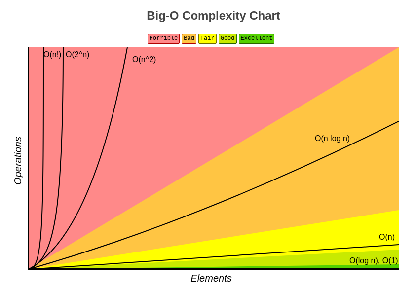

## Table of contents

### 1. Algorithms

- [Binary Search Tree](Algorithms/Sorting)
- [Breadth First Search](Algorithms/Sorting)
- [Depth First Search](Algorithms/Sorting)
- [Divide And Conquer](Algorithms/Divide%20and%20Conquer)
- [Recursion](Algorithms/Recursion)
- [Bubble Sort](Algorithms/Sorting/Bubble%20Sort)
- [Insertion Sort](Algorithms/Sorting/Insertion%20Sort)
- [Merge Sort](Algorithms/Sorting/Merge%20Sort)
- [Selection Sort](Algorithms/Sorting/Selection%20Sort)
- [Dynamic Programming](Algorithms/Dynamic%20Programming)

### 2. Data Structures

- [Linked List](Data%20Structures/Linked%20List)
- [Stacks and Queues](Data%20Structures/Stacks%20and%20Queues)
- [Trie](Data%20Structures/Trie)
- [Hash Table](Data%20Structures/Hash%20Table)
- [Heaps](Data%20Structures/Heaps)
- [Graphs](Data%20Structures/Graphs)

### 3. Interview Questions

- [First Duplicated Number](Interview%20Questions/Question%201%20-%20First%20Duplicated%20Number)
- [Reverse linked list](Interview%20Questions/Question%202%20-%20Reverse%20linked%20list)
- [Factorial](Interview%20Questions/Question%203%20-%20Factorial)
- [Fibonacci](Interview%20Questions/Question%204%20-%20Fibonacci)
- [Reserve a string](Interview%20Questions/Question%202%20-%20Reverse%20linked%20list)
- [Validate Binary Search Tree](Interview%20Questions/Question%206%20-%20Validate%20Binary%20Tree)
- [Linux Dir Tree](Interview%20Questions/Question%207%20-%20Linux%20Dir%20Tree)
- [House Robber](Interview%20Questions/Question%208%20-%20House%20Robber)
- [Best Time To Buy And Sell Stock](Interview%20Questions/Question%209%20-%20Best%20Time%20to%20Buy%20and%20Sell%20Stock)
- [Climbing Stairs](Interview%20Questions/Question%2010%20-%20Climbing%20Stairs)
## BigO

